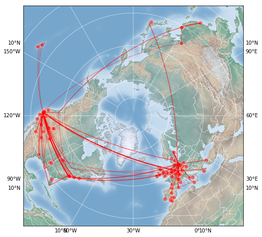

# Visualization of Flights and Places on a Map

[View the jupyter notebook here](https://nbviewer.jupyter.org/github/christopherbronner/flights-visualization/blob/master/flights_places_visualization_basemap.ipynb)

In this project, a list of places (cities) and a list of flights is visualized on a map. The lists of places and flights are given as csv files. Geographic coordniates are obtained using the `geopy` module and the map visualizations are performed with `Basemap`.

